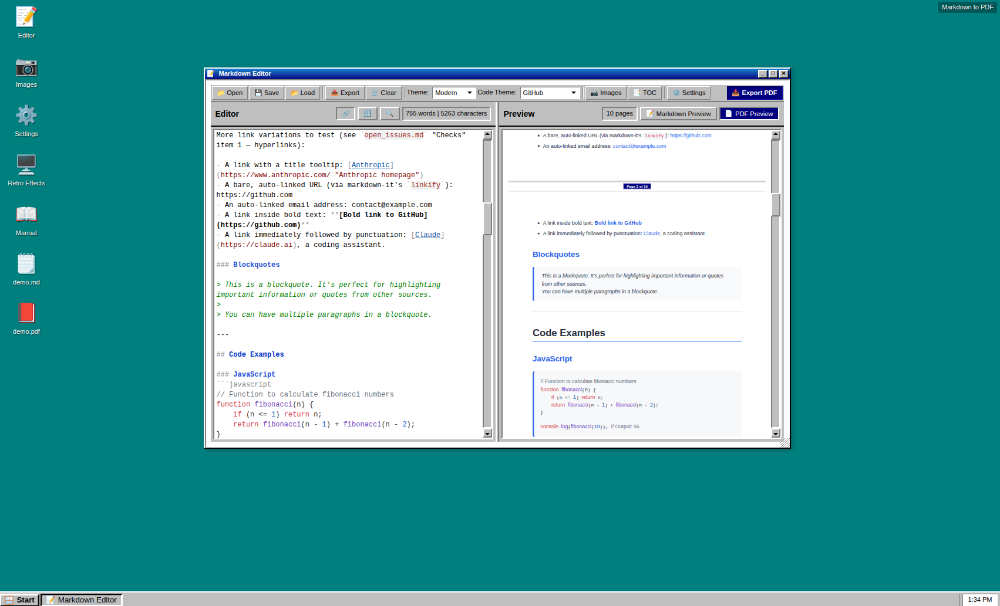

# Markdown to PDF Converter

A free, open-source tool for writing Markdown and exporting it as a clean,
styled PDF. Everything runs in the browser: there is no server, no account,
and no upload — the document never leaves your machine,
deployed on https://bumbum-markdown.com



## Highlights

- **Page-by-page preview.** The preview panel can switch to a paginated view
  that matches the exported PDF exactly, page breaks included, so there are
  no surprises at export time.
- **Nothing gets cut off.** Images, tables, code blocks, and diagrams can be
  resized directly in the preview to fit the page, instead of spilling
  across a page break.
- **Full Markdown support**, including fenced code blocks with syntax
  highlighting, Mermaid diagrams, and math notation.
- **Document controls** for page size and margins, typography, headers and
  footers, a table of contents, document metadata, an optional cover page,
  and custom CSS.
- **Multiple themes** for both the document and its code blocks.
- **Everything stored locally**, in the browser's own storage — documents,
  autosave data, settings, and images never touch a server.

## Interface

The application presents itself as a small Windows 95-style desktop:
double-click an icon to open its window, use the Start menu for the same
actions, and switch between open windows from the taskbar. A full manual
covering every feature is available from the app itself (Start menu >
Manual).

## Running locally

There is no build step and no backend — this is a static site, but it does
fetch a couple of files (such as the demo document) at runtime, so it needs
to be served over HTTP rather than opened directly as a local file.

```bash
python -m http.server 8000
# or
npx http-server -p 8000
```

Then open `http://localhost:8000` in a browser.

## License

Released under the MIT License — see [LICENSE](LICENSE).
