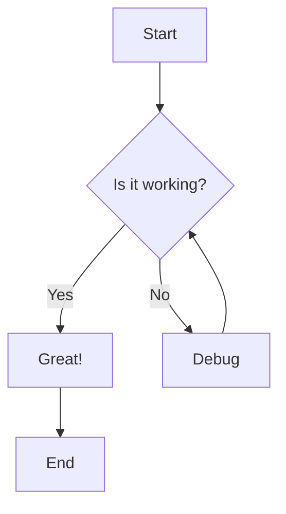
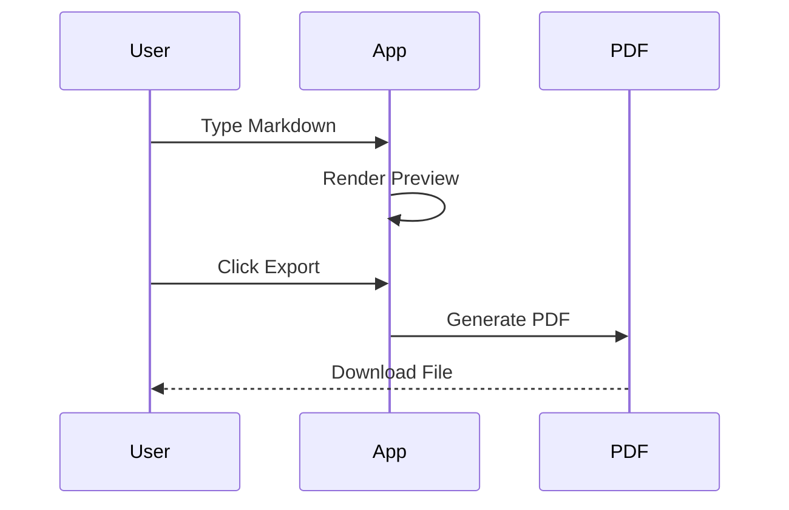
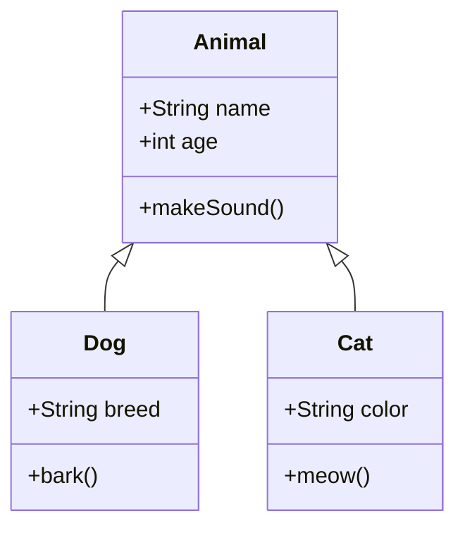

# Markdown to PDF Converter Demo

Welcome to the **Markdown to PDF Converter**! This document showcases all the features of this application.

## Table of Contents

- [Features Overview](#features-overview)
- [Markdown Basics](#markdown-basics)
- [Code Examples](#code-examples)
- [Mermaid Diagrams](#mermaid-diagrams)
- [Tables](#tables)
- [Math (LaTeX / KaTeX check)](#math-latex-katex-check)
- [Advanced Features](#advanced-features)
- [Tips for Best Results](#tips-for-best-results)
- [Keyboard Shortcuts](#keyboard-shortcuts)

---

## Features Overview

This converter supports:

- ✅ All standard Markdown syntax
- ✅ Code blocks with syntax highlighting
- ✅ Mermaid diagrams
- ✅ Multiple professional themes
- ✅ Real-time preview
- ✅ PDF export

---

## Markdown Basics

### Text Formatting

You can use **bold text**, *italic text*, ~~strikethrough~~, and `inline code`.

### Lists

#### Unordered Lists
- First item
- Second item
  - Nested item 1
  - Nested item 2
- Third item

#### Ordered Lists
1. First step
2. Second step
3. Third step

### Links and Images

Check out the [Markdown Guide](https://www.markdownguide.org/) for more information.

More link variations to test (see `open_issues.md` "Checks" item 1 — hyperlinks):

- A link with a title tooltip: [Anthropic](https://www.anthropic.com/ "Anthropic homepage")
- A bare, auto-linked URL (via markdown-it's `linkify`): https://github.com
- An auto-linked email address: contact@example.com
- A link inside bold text: **[Bold link to GitHub](https://github.com)**
- A link immediately followed by punctuation: [Claude](https://claude.ai), a coding assistant.

### Blockquotes

> This is a blockquote. It's perfect for highlighting important information or quotes from other sources.
> 
> You can have multiple paragraphs in a blockquote.

---

## Code Examples

### JavaScript
```javascript
// Function to calculate fibonacci numbers
function fibonacci(n) {
    if (n <= 1) return n;
    return fibonacci(n - 1) + fibonacci(n - 2);
}

console.log(fibonacci(10)); // Output: 55
```

### Python
```python
# Simple class example
class Person:
    def __init__(self, name, age):
        self.name = name
        self.age = age
    
    def greet(self):
        return f"Hello, my name is {self.name}!"

person = Person("Alice", 30)
print(person.greet())
```

### HTML
```html
<!DOCTYPE html>
<html lang="en">
<head>
    <meta charset="UTF-8">
    <title>Example Page</title>
</head>
<body>
    <h1>Hello, World!</h1>
    <p>This is an example HTML page.</p>
</body>
</html>
```

---

## Mermaid Diagrams

### Flowchart


### Sequence Diagram


### Class Diagram


---

## Tables

| Feature | Modern Theme | Classic Theme | Minimal Theme |
|---------|-------------|---------------|---------------|
| Colors | Blue accents | Warm tones | Monochrome |
| Font | Sans-serif | Serif | Sans-serif |
| Style | Clean | Traditional | Simple |
| Best For | Tech docs | Reports | Essays |

---

## Math (LaTeX / KaTeX check)

Inline math: $E = mc^2$ and $a^2 + b^2 = c^2$

Block math:

$$
\int_{a}^{b} f(x)\,dx = F(b) - F(a)
$$

---

## Advanced Features

### Horizontal Rules

Use three or more dashes to create a horizontal rule:

---

### Nested Lists with Code

1. First, install the dependencies:
   ```bash
   npm install markdown-it
   ```

2. Then, initialize the renderer:
   ```javascript
   const md = require('markdown-it')();
   const result = md.render('# Hello World');
   ```

3. Finally, use the rendered output in your application

---

## Tips for Best Results

1. **Use descriptive headings**: They help organize your content
2. **Add diagrams**: Visual representations make complex ideas clearer
3. **Try different themes**: Each theme has its own personality
4. **Test before exporting**: Preview helps catch formatting issues

---

## Keyboard Shortcuts

| Shortcut | Action |
|----------|--------|
| Ctrl/Cmd + B | Bold text |
| Ctrl/Cmd + I | Italic text |
| Ctrl/Cmd + K | Inline code |
| Tab | Indent (4 spaces) |

---
